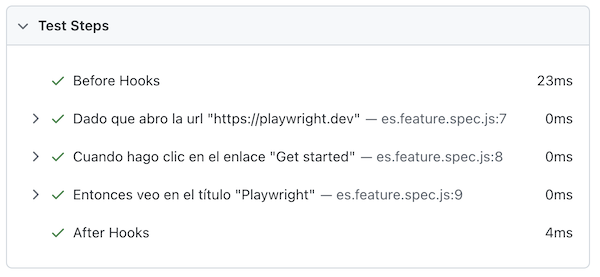

# What's new in Playwright-BDD v8

<div style="color: grey; font-style: italic">14-DEC-2024</div>

?> :fire: **Playwright-BDD v8** is packed with many updates to improve your BDD testing experience.

<!-- command to generate toc in this file: md-magic --files docs/blog/whats-new-in-v8.md -->
<!-- doc-gen TOC maxDepth="3" excludeText="Index" -->
- [Tagging Enhancements](#tagging-enhancements)
  - [Tags from path](#tags-from-path)
  - [Scoped step definitions](#scoped-step-definitions)
  - [Tagged `BeforeAll` and `AfterAll`](#tagged-beforeall-and-afterall)
  - [Default tags](#default-tags)
- [Improved Configuration Options](#improved-configuration-options)
  - [`featuresRoot` as a default directory](#featuresroot-as-a-default-directory)
  - [New option: `missingSteps`](#new-option-missingsteps)
  - [New option: `matchKeywords`](#new-option-matchkeywords)
  - [Default value for `quotes` set to `single`](#default-value-for-quotes-set-to-single)
- [Other Changes](#other-changes)
  - [New Hook aliases](#new-hook-aliases)
  - [Localized step titles](#localized-step-titles)
  - [Playwright version update](#playwright-version-update)
- [Getting Started with v8](#getting-started-with-v8)<!-- end-doc-gen -->

## Tagging Enhancements

### Tags from path

Managing test features and step definitions just got easier. In v8, you can now automatically assign tags to features and steps using **@-prefixed directory or file names**. For instance:

```
features
├── @game                     <- sets @game tag to all files inside
│   ├── game.feature
│   └── steps.ts
└── @video-player             <- sets @video-player tag to all files inside
    ├── video-player.feature
    └── steps.ts
```    

In this setup, `@game` and `@video-player` tags are automatically applied to respective features and steps. This eliminates the need for repetitive manual tagging and helps to bind features with steps.

See more details in the documentation: [tags from path](writing-features/tags-from-path.md).

### Scoped step definitions

Now you can scope step definition to specific features or scenarios by tags. Just pass `tags` expression in the second argument:

```ts
When('I click the PLAY button', { tags: '@game' }, async () => {
  // ...
});
```

This ensures that the same step can coexist in multiple features, making it easier to maintain large projects:

```ts
When('start playing', { tags: '@game' }, async () => { ... });
When('start playing', { tags: '@video-player' }, async () => { ... });
```

Full documentation: [scoped step definitions](writing-steps/scoped.md).

### Tagged `BeforeAll` and `AfterAll`
Hooks `BeforeAll` and `AfterAll` now support `name` and `tags` options:

```ts
BeforeAll({ name: 'populate db', tags: '@game' }, async () => {
  // worker setup for game
});

AfterAll({ name: 'cleanup db', tags: '@game' }, async () => {
  // worker teardown for game
});
```

Tagged hooks will be executed, only if corresponding feature is executed. 

?> Please keep in mind, that these hooks **run in each worker**, similar to Playwright worker hooks.

Full documentation: [Hooks](writing-steps/hooks.md).

### Default tags

If multiple step definitions and hooks should have the same tags, you can provide these default tags via `createBdd()` option:

```ts
const { BeforeAll, Before, Given } = createBdd(test, { 
  tags: '@game' // <- default tag
});

// all function below are tagged with `@game`
BeforeAll(async () => { ... });
Before(async () => { ... });
Given('a step', async () => { ... });
```

Full list of [createBdd() options](api.md#createbdd).

## Improved Configuration Options

### `featuresRoot` as a default directory
Since Playwright-BDD v8, `featuresRoot` is treated as a default directory for both features and steps, unless they are explicitly defined. It simplifies the configuration for a typical project:
```ts
// before
const testDir = defineBddConfig({
  features: './features/**/*.feature',
  steps: './features/steps/**/*.js',
  featuresRoot: './features',
});

// after
const testDir = defineBddConfig({
  featuresRoot: './features',
});
```

Documentation for [`featuresRoot`](configuration/options.md#featuresroot).

### New option: `missingSteps`

Control the behavior when step definitions are missing with the new `missingSteps` option. Choose between:

- `fail-on-gen` (default): Fails test generation.
- `fail-on-run`: Allows generation but fails during execution.
- `skip-scenario`: Marks the scenario as `fixme` and skips it.

Example:
```ts
const testDir = defineBddConfig({
  missingSteps: 'skip-scenario',
  // ...
});
```

Documentation for [`missingSteps`](configuration/options.md#missingsteps).

### New option: `matchKeywords`

When writing step definitions, we use different keyword functions: `Given()`, `When()` and `Then()`. Did you know, that by default all these functions are just aliases? Keyword is not used for matching with scenario steps:

Enable keyword-specific matching for step definitions with `matchKeywords` option. This enforces that `Given`, `When`, and `Then` strictly match their respective keywords in feature files.

- `matchKeywords: false` (default): Step definition keyword is not considered for matching
    ```ts
    // matches "Given a step", "When a step", "Then a step"
    Given('a step', () => { ... });
    ```

- `matchKeywords: true`: Step definition keyword is considered for matching
    ```ts
    // matches only "Given a step"
    Given('a step', () => { ... });
    ```

More details on [Keywords matching](writing-steps/keywords-matching.md).

### Default value for `quotes` set to `single`
Generated test files now use single quotes by default, reducing the need for escape characters and making files cleaner. To return to previous behavior, set `quotes` option manually:
```ts
const testDir = defineBddConfig({
  quotes: 'double',
  // ...
});
```

## Other Changes

### New Hook aliases
Introducing new aliases for hooks: 

- `BeforeAll` → `BeforeWorker`
- `AfterAll` → `AfterWorker`
- `Before` → `BeforeScenario`
- `After` → `AfterScenario`

Usage of new aliases is encouraged, because they better express when the hook runs.

### Localized step titles
Playwright HTML reporter now shows localized step titles with keywords:



### Playwright version update
Minimal Playwright version was updated to the earliest non-deprecated: **1.41**.
Please, update you `@playwright/test` dependency if needed.

?> You can check deprecated Playwright versions with the command: `npm show @playwright/test@1 deprecated`

---

Check out the full list of changes in the [Changelog](changelog).

## Getting Started with v8

To upgrade to v8, follow these steps:

1. Update your package:

   ```bash
   npm install -D playwright-bdd@latest
   ```

2. Adjust your configuration file to incorporate new options as needed.
3. Review the [Changelog](changelog) for potential breaking changes and adapt your project accordingly.
4. Run your tests to verify everything works as expected.

> In case of any bugs or questions feel free to open [an issue](https://github.com/vitalets/playwright-bdd/issues) on GitHub.

Happy testing ❤️

