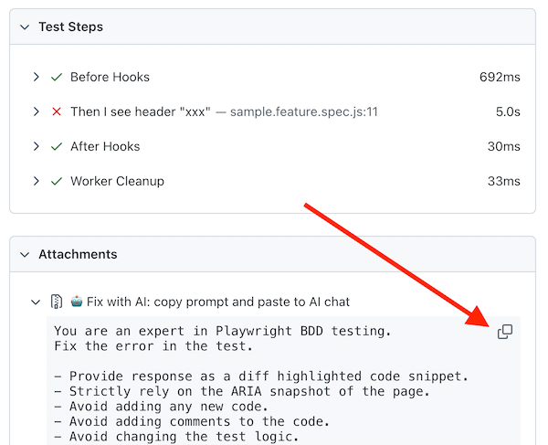

# Fix with AI

Playwright-BDD **v8.1.0** introduced a new feature **Fix with AI** that helps you fix failing tests with AI.

When a test fails, Playwright-BDD pre-generates an AI prompt and attaches it to the report.
You can copy-paste this prompt to your favorite AI chat and get suggestions on how to fix the test.

The prompt contains the relevant context of the test:

- Error message
- Scenario steps
- Test code snippet
- [ARIA snapshot](https://playwright.dev/docs/aria-snapshots) of the page

Example of the prompt attachment:


<details>
  <summary>Prompt template:</summary>

```
You are an expert in Playwright BDD testing.
Fix the error in the BDD scenario.

- Provide response as a diff highlighted code snippet.
- First, try to fix the test by adjusting Gherkin steps parameters.
- If the test is not fixable by Gherkin, try to modify the code snippet.
- Strictly rely on the ARIA snapshot of the page.
- Avoid adding any new code.
- Avoid adding comments to the code.
- Avoid changing the test logic.
- Use only role-based locators: getByRole, getByLabel, etc.
- Add a concise note about applied changes.
- If the test may be correct and there is a bug in the page, note it.

Failing gherkin scenario: 

Scenario: {scenarioName}
{steps}

Error details:
{error}

{snippet}

ARIA snapshot of the page:

{ariaSnapshot}
```

</details>

## How to enable

1. Ensure you’re on **Playwright v1.49** or newer. The Fix with AI feature requires [ARIA-snapshots](https://playwright.dev/docs/release-notes#aria-snapshots) 
to be available. 

2. Ensure you’re on **Playwright-BDD v8.1.0** or newer

3. Add the `aiFix` section to the BDD config:
    ```js
    const testDir = defineBddConfig({
      aiFix: {
        promptAttachment: true,
      },
      // ...other options
    });
    ```

That's it. Now you can run the failing test and check out the HTML reports.

### Playwright HTML report

In the Playwright HTML report, you can expand the attachment and copy the prompt by clicking the small button in the top-right corner:



### Cucumber HTML report

In the Cucumber HTML report, there are additional controls that help to copy the prompt to the clipboard and open ChatGPT:


## Prompt customization

You can customize the prompt template to get better results for your project:

```js
const testDir = defineBddConfig({
  aiFix: {
    promptAttachment: true,
    promptTemplate: 'my custom prompt'
  },
  // ...other options
});
```

Check out the [default prompt](https://github.com/vitalets/playwright-bdd/blob/main/src/ai/promptTemplate.ts) for inspiration and a list of available placeholders:

- `{scenarioName}`
- `{steps}`
- `{error}`
- `{snippet}`
- `{ariaSnapshot}`

?> If you get some awesome results with your custom prompt, feel free to share it with the community in the [issues](https://github.com/vitalets/playwright-bdd/issues) or [Discord](https://discord.gg/5rwa7TAGUr)!

## Switching the page

By default, the prompt uses the ARIA snapshot for Playwright's built-in `page`.
It may not be applicable in multi-page scenarios, where you create your own page instances. 
For example:

```js
When('I open a new tab', async ({ page, context }) => {
  const [newPage] = await Promise.all([
    context.waitForEvent('page'),
    page.getByRole('link').click(),
  ]);
  await expect(newPage.getByRole('heading')).toContainText('Another page');
});
```

To handle this case, you can utilize the `$prompt` BDD fixture: 

```js
When('I open a new tab', async ({ page, context, $prompt }) => { // <-- add $prompt fixture
  const [newPage] = await Promise.all([
    context.waitForEvent('page'),
    page.getByRole('link').click(),
  ]);
  $prompt.setPage(newPage); // <-- call $prompt.setPage() to switch the page
  await expect(newPage.getByRole('heading')).toContainText('Another page');
});
```