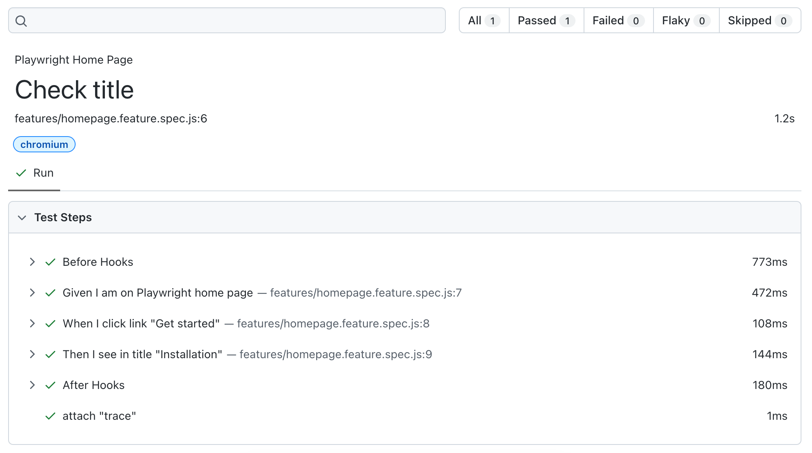

<!-- this file differs from README.md in project root -->

<div align="center">
  <a href="/">
    
  </a>
</div>

<h1 align="center">Playwright-BDD</h1>

<div align="center">

Run [BDD](https://cucumber.io/docs/bdd/) tests with [Playwright](https://playwright.dev/) runner

</div>

## Quick start
Jump to the [getting started](getting-started/index.md) guide or read below some technical details about Playwright-BDD.

## Why Playwright runner?
Both [Playwright](https://playwright.dev/) and [CucumberJS](https://github.com/cucumber/cucumber-js) have their own test runners. 
You can use the CucumberJS runner with [Playwright as a library](https://playwright.dev/docs/library) to test BDD scenarios.
This package offers an **alternative way**: convert BDD scenarios into Playwright tests and run them with the Playwright runner as usual. 
This approach brings all the benefits of the Playwright runner:

* Automatic browser initialization and cleanup
* Auto-capture of screenshots, videos, and traces
* Parallelization with sharding
* Auto-waiting of page elements
* Out-of-box visual comparison testing
* Power of Playwright fixtures
* [...and much more](https://playwright.dev/docs/library#key-differences)

## How Playwright-BDD works
A typical command to run tests with Playwright-BDD is:
```
npx bddgen && npx playwright test
```

### Phase 1: Generate tests
The first command `npx bddgen` generates test files from BDD feature files. For example:

From
```gherkin
Feature: Playwright Home Page

    Scenario: Check title
        Given I am on Playwright home page
        When I click link "Get started"
        Then I see in title "Installation"
```

To
```js
import { test } from 'playwright-bdd';

test.describe('Playwright Home Page', () => {

  test('Check title', async ({ Given, When, Then }) => {
    await Given('I am on Playwright home page');
    await When('I click link "Get started"');
    await Then('I see in title "Installation"');
  });

});    
```

### Phase 2: Run tests
The second command `npx playwright test` runs the generated files with the Playwright runner.
Step definitions have access to the Playwright APIs and fixtures (e.g. `page`):

```js
Given('I am on Playwright home page', async ({ page }) => {
  await page.goto('https://playwright.dev');
});

When('I click link {string}', async ({ page }, name) => {
  await page.getByRole('link', { name }).click();
});

Then('I see in title {string}', async ({ page }, text) => {
  await expect(page).toHaveTitle(new RegExp(text));
});  
```

HTML report shows all scenarios and steps:



Proceed to the [installation guide](getting-started/installation.md) and try it yourself.